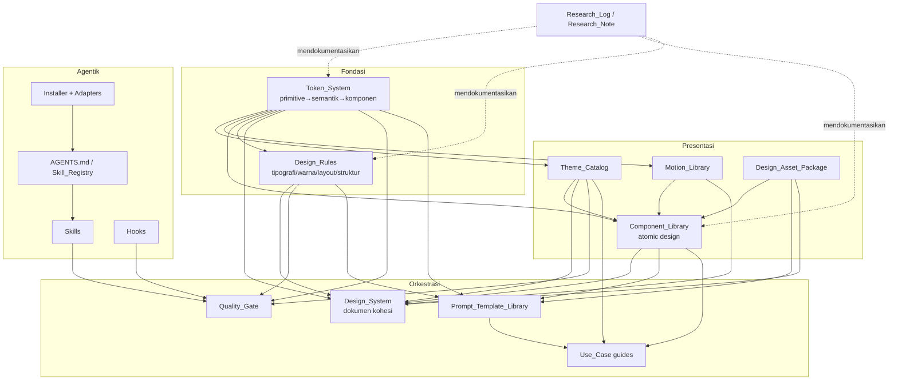
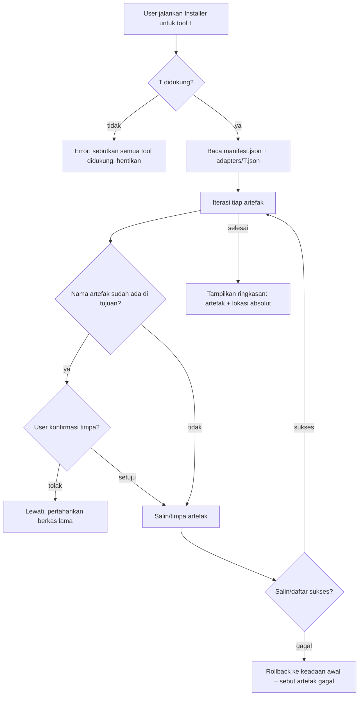

# Design Document — ProdigeUI

## Overview

ProdigeUI adalah **UI/UX kit system portabel** yang dikemas sebagai satu folder root `prodigeui`
dan dapat dipasang ke beragam Agentic_Tool (Claude Code, GLM, Codex, Antigravity, Hermes, Cursor).
Tujuannya membekali AI agent dengan pengetahuan, aturan, aset, dan alur kerja terstruktur agar mampu
merancang UI/UX kelas enterprise, interaktif, dan bebas "AI slop".

Desain ini membumikan arsitekturnya pada pola nyata dari repositori riset — khususnya
`open-design-main` yang menyusun sistemnya dari kombinasi: `AGENTS.md`/`CLAUDE.md` (entry point agent),
`skills/*/SKILL.md` (unit kemampuan berformat frontmatter + isi), `prompt-templates/`,
`design-systems/*` (masing-masing berisi `design-tokens.json`, `tokens.css`, `manifest.json`,
`DESIGN.md`, `components.manifest.json`), `design-templates/`, `plugins/`, dan `.claude-plugin/`.
Prinsip Design_Rules dan Motion diturunkan dari koleksi buku (`Atomic Design`, `The Elements of
Typographic Style`, teori warna, motion/animation, `Don't Make Me Think`, `The Design of Everyday
Things`, `Laws of UX`, `100 Things Every Designer Needs to Know`, `Universal Principles of Design`).

Ide arsitektural inti:

- **Sumber kebenaran tunggal berlapis (single source of truth):** seluruh keputusan visual bermuara
  pada Token_System berlapis (primitive → semantik → komponen). Tidak ada nilai mentah di komponen,
  aturan, atau tema.
- **Artefak sebagai data yang dapat divalidasi:** token, tema, skill, aset, dan prompt template
  disimpan dalam format machine-readable (JSON + frontmatter) sehingga bisa divalidasi, diturunkan,
  dan diperiksa Quality_Gate secara otomatis.
- **Portabilitas melalui adaptor:** satu isi kanonik ProdigeUI, banyak "muka" (`AGENTS.md`,
  `CLAUDE.md`, dsb.) yang diproduksi oleh Installer per Agentic_Tool.
- **Ketertelusuran riset:** setiap sumber (repo/buku) memiliki tepat satu Research_Note yang terindeks
  di Research_Log tunggal.

### Pemetaan Requirement → Bagian Desain

| Requirement | Bagian desain utama |
|---|---|
| R1 Portabilitas & Instalasi | Arsitektur; Installer & Adaptor Agentic_Tool; Error Handling |
| R2 Struktur Agentic Workflow | Skill_Registry & Agentic_Workflow; Model Data (frontmatter SKILL.md) |
| R3 Semantic Design Tokens | Token_System; Model Data (schema token); Correctness Properties |
| R4 Theme Catalog | Theme Mechanism; Error Handling (validasi theme) |
| R5 Motion Presets | Motion_Library |
| R6 Component Library | Component_Library (atomic design) |
| R7 Design Asset Packages | Design_Asset_Package & metadata lisensi |
| R8 Design System & Kohesi | Design_System (kohesi lintas artefak) |
| R9 Design Rules | Design_Rules terukur; Quality_Gate |
| R10 Prompt Template Library | Prompt_Template_Library |
| R11 Multi Use Case | Use_Case coverage; Prompt/Theme/Component mapping |
| R12 Quality Gate | Quality_Gate |
| R13 Aksesibilitas | Accessibility (lintas bagian) |
| R14 Artefak Riset | Research_Log / Research_Note |

## Arsitektur

### Struktur Folder `prodigeui`

```
prodigeui/
├── AGENTS.md                     # Entry point kanonik (R2.1) — tujuan, struktur, cara pakai skill
├── CLAUDE.md                     # Adaptor isi setara untuk Claude Code (R1.10)
├── README.md                     # Ikhtisar + tautan instalasi
├── manifest.json                 # Manifest artefak: daftar & tipe setiap artefak (dipakai Installer)
│
├── tokens/                       # Token_System (R3)
│   ├── primitive.tokens.json     #   Lapis 1: nilai konkret (palet, skala mentah)
│   ├── semantic.tokens.json      #   Lapis 2: peran (color.surface.primary → primitive)
│   ├── component.tokens.json     #   Lapis 3: token komponen (button.bg → semantic)
│   ├── tokens.schema.json        #   JSON Schema untuk validasi
│   └── build/                    #   Turunan CSS variables (dihasilkan, R3.6)
│       └── tokens.css
│
├── themes/                       # Theme_Catalog (R4)
│   ├── _default.theme.json       #   Theme default (fallback nilai, R3.9/R4)
│   ├── light.theme.json
│   ├── dark.theme.json
│   ├── <brand/use-case>.theme.json
│   └── theme.schema.json
│
├── motion/                       # Motion_Library (R5)
│   ├── motion.tokens.json        #   Token durasi & easing
│   ├── presets/                  #   Preset per kategori (enter-exit, state, hover-focus, scroll)
│   └── principles.md             #   Prinsip motion (tujuan, hierarki, timing)
│
├── components/                   # Component_Library (R6), disusun atomic design
│   ├── atoms/                    #   Button, Input, Icon, Text ...
│   ├── molecules/                #   Field, Card, MenuItem ...
│   ├── organisms/                #   Form, Navbar, Table, Modal ...
│   ├── components.manifest.json  #   Metadata: varian, props, states per komponen
│   └── composition-guidelines.md #   Pedoman komposisi atomic design (R6.6)
│
├── assets/                       # Design_Asset_Package (R7)
│   ├── icons/  fonts/  illustrations/
│   └── assets.manifest.json      #   Metadata + lisensi + id unik tiap aset
│
├── design-system/                # Design_System kohesi (R8)
│   ├── design-system.md          #   Dokumen kohesi + dependency graph antar artefak
│   └── entry-point.md            #   Urutan penggunaan artefak untuk proyek baru
│
├── design-rules/                 # Design_Rules terukur (R9, R13.6)
│   ├── typography.rules.json
│   ├── color.rules.json
│   ├── layout.rules.json
│   ├── structure.rules.json
│   └── design-rules.md           #   Penjelasan naratif + rasional (bersumber buku)
│
├── prompt-templates/             # Prompt_Template_Library (R10)
│   ├── saas/  landing/  ecommerce/  portfolio/  hris/  agentic-app/
│   └── template.schema.json
│
├── use-cases/                    # Cakupan multi use-case (R11)
│   └── <use-case>/guide.md       #   Menautkan Component + Theme + Prompt_Template
│
├── quality-gate/                 # Quality_Gate (R12, R13.7)
│   ├── criteria.json             #   Daftar kriteria lolos/gagal objektif
│   ├── anti-ai-slop.checklist.md
│   └── report.schema.json
│
├── skills/                       # Agentic_Workflow — Skill (R2)
│   ├── <skill-name>/SKILL.md
│   └── AGENTS.md                 #   Skill_Registry (indeks skill)
│
├── hooks/                        # Hooks/plugins/scripts terdokumentasi (R2.6)
│   └── <hook>.md
│
├── installers/                   # Installer & adaptor per Agentic_Tool (R1)
│   ├── install.<tool>.md         #   Instruksi terdokumentasi per tool (R1.9)
│   └── adapters/<tool>.json      #   Peta lokasi konfigurasi tujuan per tool
│
└── research/                     # Research_Log & Research_Note (R14)
    ├── research-log.json         #   Indeks tunggal (satu entri per note)
    └── notes/<source-id>.note.md
```

### Diagram Artefak & Relasi

Menegaskan kohesi design system (R8.1): setiap artefak memiliki setidaknya satu referensi menuju
artefak yang bergantung padanya. Token_System adalah akar dependensi.



### Alur Instalasi (R1)



## Komponen dan Antarmuka

Bagian ini menjabarkan desain tiap sub-sistem beserta antarmuka logis (kontrak) yang digunakan
untuk validasi dan derivasi. Antarmuka dinyatakan sebagai operasi murni (pure) sedapat mungkin,
agar dapat diuji berbasis properti.

### 1. Token_System (R3, R8.2, R8.3)

Berlapis tiga sesuai Atomic-style token layering (mirip `A1-identity`/`A2`/`B-slot` pada
`open-design-main`, dipetakan ke istilah primitive/semantik/komponen):

- **Primitive**: nilai konkret dan bebas konteks — palet warna mentah, skala spacing dasar,
  skala tipografi, radius, shadow, border width, z-index. Contoh: `palette.blue.500 = "#3b82f6"`,
  `scale.space.4 = "16px"`.
- **Semantik**: peran, mereferensikan primitive. Nama TIDAK memuat nilai literal (R3.3). Contoh:
  `color.surface.primary → {ref: palette.white}`, `space.md → {ref: scale.space.4}`.
- **Komponen**: mereferensikan token semantik. Contoh: `button.primary.bg → {ref: color.action.primary}`.

Kategori wajib (R3.2): `color`, `typography`, `spacing`, `radius`, `shadow`/`elevation`,
`border`, `z-index` (plus `motion` untuk R5.3).

Antarmuka logis:

```
resolveToken(name, tokenSet) -> ResolvedValue | UnresolvedError
   // Menelusuri rantai referensi hingga nilai konkret. Mendeteksi referensi
   // tak terdefinisi (R3.5) dan siklus (R3.8).

validateTokenSet(tokenSet) -> ValidationReport
   // Memeriksa: semua referensi terdefinisi, tidak ada siklus, nama semantik
   // tidak literal. Gagal tanpa emit keluaran token bila ada error (R3.5).

buildCssVariables(resolvedTokenSet) -> CssText
   // Menurunkan token menjadi :root { --name: value } (R3.6). Round-trip aman.

parseCssVariables(cssText) -> TokenValueMap
   // Kebalikan buildCssVariables untuk verifikasi round-trip.
```

Aturan penamaan (verifikasi R3.3): nama token semantik/komponen di-uji terhadap pola literal
(hex `#...`, `rgb(...)`, angka+unit `px|rem|em|%`). Bila cocok → invalid.

### 2. Theme Mechanism (R4, R3.7, R3.9)

Theme adalah pemetaan `token semantik → nilai` (override lapis primitive), tanpa mengubah nama token
semantik (R3.7). Struktur:

- `_default.theme.json` menjadi sumber fallback (R3.9, R4): bila theme lain tidak mendefinisikan
  suatu token semantik, nilai diambil dari default dan ditandai `incomplete` pada laporan.
- `validateTheme(theme, requiredSemanticTokens, componentLib)` memastikan setiap token semantik yang
  dipakai Component_Library terdefinisi (R4.2, R4.4); token hilang dilaporkan by-name.
- `checkThemeContrast(theme)` menghitung rasio kontras WCAG (relative luminance) untuk pasangan
  teks/latar dan memverifikasi ambang 4.5:1 (teks normal) dan 3:1 (teks besar / non-teks) (R4.6, R13).
- Klasifikasi light/dark (R4.1) diverifikasi via luminance: theme light → luminance(bg) >
  luminance(teks utama); dark → sebaliknya.

Antarmuka:

```
applyTheme(theme) -> ResolvedTokenSet   // Semua nilai dari theme aktif, tanpa hardcode (R4.3)
validateTheme(theme, requiredTokens) -> ThemeValidationReport
checkThemeContrast(theme) -> ContrastReport
classifyTheme(theme) -> "light" | "dark"
```

### 3. Motion_Library (R5)

- Preset dikelompokkan per kategori: `enter-exit`, `state-transition`, `hover-focus`, `scroll-based`
  (minimal satu tiap kategori, R5.1).
- Setiap preset menautkan `duration` dan `easing` ke Design_Token motion (R5.3), bukan nilai mentah.
  Durasi wajib dalam [100ms, 1000ms]; easing wajib berupa fungsi bernama (`ease`, `ease-in-out`, dll.)
  atau `cubic-bezier(...)` (R5.2).
- Mode reduce-motion (R5.4): resolver preset menghasilkan varian yang menonaktifkan animasi
  non-esensial dan membatasi animasi esensial ≤100ms tanpa gerakan berbasis posisi/parallax.
- `principles.md` mendokumentasikan prinsip motion; setiap preset menaut minimal satu prinsip (R5.5).

```
resolveMotionPreset(preset, motionTokens, reduceMotion) -> ResolvedMotion
validateMotionPreset(preset) -> MotionValidationReport  // rentang durasi & bentuk easing
```

### 4. Component_Library (R6, atomic design)

- Disusun `atoms → molecules → organisms` (atomic design, R6.6), tiap kategori fungsional terpenuhi:
  input & form, navigasi, feedback, data display, layout, overlay (R6.1).
- Setiap komponen mengambil seluruh nilai visual dari Design_Token (R6.2) — divalidasi dengan memindai
  definisi komponen untuk nilai mentah.
- `components.manifest.json` mendokumentasikan varian, props, dan state (default, hover, focus, active,
  disabled, error) tiap komponen interaktif (R6.3), atribut ARIA + operasi keyboard + indikator fokus
  (R6.4, R13.4/R13.5).
- Fallback token (R6.7): bila token yang dirujuk tidak valid saat theme diterapkan, komponen memakai
  nilai token default agar tetap dapat digunakan (tidak kosong/rusak).
- Reaktivitas theme (R6.5): pergantian theme merender ulang via CSS variables tanpa reload.
- State disabled (R6.8): komponen mengabaikan input dan tidak memicu aksi.

### 5. Design_Asset_Package (R7)

- Tiga kategori (icons, fonts, illustrations) minimal 5 aset/kategori (R7.1).
- Setiap aset punya `id` unik + metadata lisensi lengkap (nama lisensi, sumber/pemegang hak, status
  komersial) (R7.2). Aset dengan metadata tak lengkap TIDAK disertakan dan memicu error (R7.5).
- Batasan komersial ditandai eksplisit pada metadata (R7.3).
- Referensi aset dari Component/Prompt_Template memakai `id` unik; referensi ke id tak dikenal
  menghasilkan error "aset tidak ditemukan" dan mempertahankan konfigurasi lama (R7.6).

```
validateAssetPackage(pkg) -> AssetValidationReport  // buang aset metadata tak lengkap (R7.5)
resolveAssetRef(id, pkg) -> Asset | AssetNotFoundError (R7.6)
```

### 6. Design_System (R8)

Dokumen `design-system.md` menautkan keenam artefak inti (Token_System, Theme_Catalog, Motion_Library,
Component_Library, Design_Asset_Package, Design_Rules) dengan dependency graph — tiap artefak punya
≥1 referensi terdokumentasi (R8.1). `entry-point.md` menjelaskan urutan pemakaian (token → tema →
motion/aset → komponen → aturan) untuk proyek baru (R8.4).

Kohesi diverifikasi: skala spacing & tipografi hanya sebagai token (R8.2); perubahan skala dasar
otomatis merambat via referensi (R8.3); referensi tak terdefinisi ditandai (R8.5); konflik definisi
token dengan nama sama menandai konflik dan mempertahankan Token_System sebagai sumber kebenaran (R8.6).

### 7. Design_Rules (R9, R13.6)

Aturan disimpan sebagai data terukur (JSON) + narasi (`design-rules.md`) dengan rasional bersumber
buku:

- **Tipografi** (R9.1): rasio skala tetap (mis. 1.25 modular scale), rentang line-height sebagai rasio
  terhadap ukuran font, daftar weight diizinkan, daftar font pairing diizinkan. (bersumber *The Elements
  of Typographic Style*).
- **Warna** (R9.2): peran warna, penggunaan aksen, ambang kontras (4.5:1 / 3:1). (teori warna + WCAG).
- **Layout** (R9.3): grid kolom tetap, ≥3 breakpoint (mobile/tablet/desktop dengan ambang lebar),
  skala spacing dari satu unit dasar. (*Grid Systems in Graphic Design*).
- **Struktur** (R9.4): hierarki visual, pengelompokan konten, pola navigasi. (*Don't Make Me Think*,
  *Universal Principles of Design*).
- Setiap aturan dinyatakan sebagai kriteria terverifikasi — rentang, rasio, atau daftar pilihan (R9.5).
  Aturan yang tidak terukur ditandai "tidak dapat dievaluasi" oleh Quality_Gate (R9.8).

### 8. Prompt_Template_Library (R10)

- Minimal satu template per Use_Case (R10.1), mereferensikan Design_Rules/Token_System/Component_Library
  relevan (R10.2). Referensi tak valid → template ditolak dengan pesan (R10.8).
- Setiap template memuat bagian eksplisit: **context**, **constraint**, **output criteria**, dan
  mencakup seluruh elemen baseline `prompt-templates` `open-design-main` — plus superset yang lebih pro
  (persona, referensi token/rule/komponen, checklist Quality_Gate & aksesibilitas) (R10.3).
- Setiap template menyertakan ≥1 contoh keluaran + kriteria penerimaan (R10.4).
- Template mengarahkan agent mematuhi Quality_Gate (R10.5) dan Accessibility_Standard (R10.6).
- Use_Case tanpa template ditandai error, tidak menyajikan template kosong (R10.7).

### 9. Installer & Adaptor per Agentic_Tool (R1)

- `manifest.json` mendaftar semua artefak; `adapters/<tool>.json` memetakan lokasi konfigurasi tujuan
  tiap tool didukung (Claude Code, GLM, Codex, Antigravity, Hermes, Cursor) (R1.2).
- Alur transaksional dengan rollback (lihat diagram): tool tak didukung → hentikan + sebut daftar
  (R1.5); nama artefak bentrok → minta konfirmasi (R1.6), tolak → lewati (R1.7); gagal salin → rollback
  + sebut artefak gagal (R1.8); sukses → ringkasan artefak + lokasi absolut (R1.4).
- Adaptor isi: bila tool tak mendukung format asli, hasilkan berkas setara (`AGENTS.md`, `CLAUDE.md`)
  (R1.10). Instruksi instalasi terdokumentasi per tool (R1.9).

### 10. Skill_Registry & Agentic_Workflow (R2)

- `AGENTS.md` root: tujuan sistem, struktur folder, cara menemukan/menjalankan skill (R2.1).
- Tiap Skill = folder + tepat satu `SKILL.md` (R2.2) dengan frontmatter `name` (unik), `description`,
  `triggers` (R2.3). Format mengikuti pola nyata `open-design-main/skills/*/SKILL.md`.
- `skills/AGENTS.md` = Skill_Registry: mencantumkan semua skill + name/deskripsi/pemicu (R2.4);
  penambahan skill baru tidak mengubah entri lama (R2.5, append-only).
- Folder tanpa `SKILL.md` diabaikan & ditandai invalid (R2.8); frontmatter kurang field wajib → tidak
  dicantumkan + indikasi field hilang (R2.9).
- Minimal satu skill mengarahkan perancangan UI/UX end-to-end brief→implementasi (R2.7).
- Hooks/plugins/scripts terdokumentasi: pemicu, efek, cara aktivasi (R2.6).

### 11. Quality_Gate (R12, R9.6-R9.8, R13.7-R13.8)

- `criteria.json`: daftar kriteria dengan definisi lolos/gagal objektif — kepatuhan Design_Rules,
  pemakaian Design_Token (bukan nilai mentah), konsistensi Theme, aksesibilitas (R12.1).
- Evaluasi menghasilkan status per kriteria tanpa ada yang tak dievaluasi (R12.2); keseluruhan "lolos"
  hanya bila semua lolos (R12.3). Kegagalan menyertakan id kriteria, deskripsi, rekomendasi (R12.4).
- Checklist anti-AI-slop terukur: nilai mentah vs token, hierarki visual melanggar Design_Rules,
  kontras di bawah ambang (R12.5).
- Dapat dijalankan sebagai bagian workflow via skill/hook & mengembalikan hasil (R12.6).
- Deteksi ≥1 pelanggaran aksesibilitas → hasil gagal (R13.8).

### 12. Research_Log & Research_Note (R14)

- `research-log.json`: indeks tunggal, tepat satu entri per Research_Note; entri memuat identitas
  sumber + referensi ke note (R14.1).
- Satu Research_Note per repo (R14.2) dan per buku (R14.3), memuat tiga kategori temuan (copy,
  ditingkatkan, diadaptasi) — kategori kosong ditandai eksplisit "tidak ada" (R14.4).
- Note memuat identitas + lokasi sumber agar tertelusuri ke berkas asli (R14.5); temuan yang diterapkan
  mereferensikan artefak tujuan via id unik (R14.6).
- Pembuatan note + penambahan entri log adalah satu operasi (R14.7); kegagalan pembuatan menandai sumber
  "belum terdokumentasi" tanpa mengubah note lain (R14.8).

## Model Data

### Schema Token (`tokens.schema.json`) — R3

```jsonc
{
  "schemaVersion": 1,
  "layer": "primitive | semantic | component",
  "tokens": {
    // key = nama token; nilai = konkret ATAU referensi
    "color.surface.primary": {
      "type": "color",                 // color|typography|spacing|radius|shadow|border|z-index|motion
      "ref": "palette.white",          // referensi ke token lapis di bawahnya (opsional)
      "value": null,                    // nilai konkret (wajib bila tak ada ref, hanya di primitive)
      "description": "Latar permukaan utama"
    },
    "palette.white": { "type": "color", "value": "#ffffff" }
  }
}
```

Invariant: token `semantic`/`component` WAJIB punya `ref` (bukan `value` literal); token `primitive`
punya `value` konkret. Nama token semantik/komponen tidak boleh cocok pola literal.

### Schema Theme (`theme.schema.json`) — R4

```jsonc
{
  "name": "dark",
  "mode": "light | dark",
  "extends": "_default",              // sumber fallback (R3.9)
  "overrides": {
    "color.surface.primary": "palette.slate.900",  // ref ke primitive
    "color.text.primary": "palette.slate.50"
  }
}
```

### Frontmatter `SKILL.md` — R2.3

```yaml
---
name: prodige-ui-end-to-end        # unik di Skill_Registry (R2.3)
description: |
  Merancang UI/UX end-to-end dari brief hingga implementasi memakai ProdigeUI.
triggers:
  - "design ui"
  - "buat komponen"
  - "ui end to end"
# opsional
category: design-system
outputs: [design-spec, components, quality-report]
---
# <isi skill: langkah, referensi token/rule/komponen, contoh>
```

Field wajib: `name`, `description`, `triggers`. Kekurangan salah satu → skill tak terdaftar + indikasi
field hilang (R2.9).

### Schema Metadata Aset (`assets.manifest.json`) — R7

```jsonc
{
  "assets": [
    {
      "id": "icon.arrow-right",       // pengidentifikasi unik (R7.4)
      "category": "icon | font | illustration",
      "path": "icons/arrow-right.svg",
      "license": {
        "name": "MIT",                // nama lisensi (R7.2)
        "source": "Feather Icons",    // sumber/pemegang hak (R7.2)
        "commercialUse": "allowed | restricted"  // status komersial (R7.2/R7.3)
      }
    }
  ]
}
```

Aset tanpa `license.name` + `license.source` + `license.commercialUse` lengkap → dibuang + error (R7.5).

### Schema Component Manifest (`components.manifest.json`) — R6

```jsonc
{
  "components": [
    {
      "name": "Button",
      "level": "atom | molecule | organism",
      "category": "input|navigation|feedback|data-display|layout|overlay",
      "interactive": true,
      "variants": ["primary", "secondary", "ghost"],
      "props": ["size", "disabled", "iconLeft"],
      "states": ["default","hover","focus","active","disabled","error"],  // R6.3
      "a11y": { "role": "button", "keyboard": ["Enter","Space"], "focusVisible": true },  // R6.4
      "tokens": ["button.primary.bg", "button.primary.fg", "radius.md"]   // hanya token (R6.2)
    }
  ]
}
```

### Schema Design_Rules (contoh `typography.rules.json`) — R9

```jsonc
{
  "typography": {
    "scaleRatio": 1.25,                          // rasio skala tetap (R9.1)
    "lineHeightRange": { "min": 1.3, "max": 1.7 }, // rasio terhadap font-size (R9.1)
    "allowedWeights": [400, 500, 600, 700],       // daftar weight (R9.1)
    "allowedPairings": [                          // daftar pasangan font (R9.1)
      { "heading": "Inter", "body": "Inter" }
    ],
    "minFontSizePx": 14                           // aksesibilitas (R13.6)
  }
}
```

Setiap aturan berupa kriteria terverifikasi: rentang/rasio/daftar (R9.5). Layout rules memuat
`gridColumns`, `breakpoints` (≥3), `spacingBaseUnit`; color rules memuat `contrast.normal=4.5`,
`contrast.large=3` (R9.2/R9.3).

### Schema Quality_Gate Report (`report.schema.json`) — R12

```jsonc
{
  "overall": "pass | fail",             // pass hanya bila semua kriteria pass (R12.3)
  "criteria": [
    {
      "id": "no-raw-values",
      "status": "pass | fail | not-evaluable",   // not-evaluable utk aturan tak terukur (R9.8)
      "issue": "…",                     // deskripsi bila fail (R12.4)
      "location": "components/atoms/Button",       // lokasi pelanggaran (R9.6, R13.7)
      "recommendation": "…"             // saran perbaikan (R12.4)
    }
  ]
}
```

### Schema Research_Note & Research_Log — R14

```jsonc
// research-log.json — indeks tunggal (R14.1)
{
  "notes": [
    { "sourceId": "open-design-main", "sourceType": "repo",
      "note": "notes/open-design-main.note.md", "status": "documented | pending" }  // R14.8
  ]
}
```

```markdown
<!-- notes/<source-id>.note.md — frontmatter -->
---
sourceId: open-design-main
sourceType: repo | book                 # R14.2/R14.3
sourceName: "open-design-main"
sourceLocation: "Skill & Library/open-design-main"   # tertelusuri (R14.5)
appliedTo: ["tokens/semantic.tokens.json", "skills/AGENTS.md"]  # id artefak (R14.6)
---
## Poin yang di-copy
- … (atau "tidak ada")               # kategori eksplisit (R14.4)
## Poin yang ditingkatkan/diperbaiki
- … (atau "tidak ada")
## Poin yang diadaptasi
- … (atau "tidak ada")
```

## Correctness Properties

*Sebuah properti adalah karakteristik atau perilaku yang harus selalu benar di seluruh eksekusi
valid dari sebuah sistem — pada dasarnya pernyataan formal tentang apa yang seharusnya dilakukan
sistem. Properti menjadi jembatan antara spesifikasi yang dapat dibaca manusia dan jaminan
kebenaran yang dapat diverifikasi mesin.*

Properti di bawah diturunkan dari prework dan telah dikonsolidasi untuk menghilangkan redundansi.
Setiap properti bersifat terkuantifikasi universal ("untuk setiap …") dan ditujukan untuk
property-based testing.

### Property 1: Resolusi & validasi referensi token

*Untuk setiap* Token_System, `validateTokenSet` menghasilkan lolos jika dan hanya jika seluruh
referensi token terdefinisi dan tidak ada referensi melingkar; ketika lolos, `resolveToken`
menyelesaikan setiap token semantik dan komponen ke nilai konkret melalui rantai referensi yang sah
(komponen→semantik→primitive), dan ketika gagal tidak ada keluaran token yang dihasilkan.

**Validates: Requirements 3.4, 3.5, 3.8**

### Property 2: Referensi menggantung & siklus dilaporkan secara identifikatif

*Untuk setiap* Token_System yang mengandung referensi tak terdefinisi atau siklus, laporan validasi
mengidentifikasi token perujuk beserta nama referensi tak terdefinisi (untuk dangling) atau rantai
token pembentuk siklus (untuk siklus).

**Validates: Requirements 3.5, 3.8**

### Property 3: Nama token semantik/komponen tidak literal

*Untuk setiap* token pada lapis semantik atau komponen, nama token tidak cocok dengan pola nilai
literal (kode warna hex/rgb, atau angka berunit px/rem/em/%); validator menolak nama literal dan
menerima nama berbasis peran.

**Validates: Requirements 3.3**

### Property 4: Round-trip token ↔ CSS variables

*Untuk setiap* Token_System terselesaikan, menurunkannya menjadi CSS variables lalu mem-parsing
kembali (`parseCssVariables(buildCssVariables(t))`) menghasilkan himpunan pasangan nama→nilai yang
setara dengan token terselesaikan semula.

**Validates: Requirements 3.6**

### Property 5: Resolusi memakai nilai efektif dengan nama semantik yang invariant

*Untuk setiap* Token_System dan setiap perubahan nilai pada token yang dirujuk (termasuk penggantian
nilai per Theme dan perubahan skala dasar), himpunan nama token semantik tetap tidak berubah dan
seluruh token/artefak yang merujuknya menyelesaikan (resolve) ke nilai efektif yang baru tanpa
penyuntingan manual per artefak.

**Validates: Requirements 3.7, 8.3**

### Property 6: Fallback nilai theme yang tidak lengkap

*Untuk setiap* Theme yang tidak mendefinisikan nilai bagi sejumlah token semantik terdefinisi, token
tersebut menyelesaikan ke nilai dari Theme default dan ditandai `incomplete` pada laporan validasi.

**Validates: Requirements 3.9**

### Property 7: Kelengkapan token semantik pada Theme

*Untuk setiap* Theme dan himpunan token semantik yang dibutuhkan Component_Library, `validateTheme`
lolos jika dan hanya jika setiap token semantik yang dibutuhkan memiliki nilai; ketika gagal, keluaran
validasi menyebutkan setiap nama token semantik yang hilang.

**Validates: Requirements 4.2, 4.4**

### Property 8: Konsistensi klasifikasi light/dark terhadap luminance

*Untuk setiap* Theme, `classifyTheme` menghasilkan "light" jika dan hanya jika luminance warna latar
lebih tinggi daripada luminance warna teks utamanya, dan "dark" jika dan hanya jika sebaliknya.

**Validates: Requirements 4.1**

### Property 9: Kepatuhan kontras Theme

*Untuk setiap* Theme dalam Theme_Catalog dan setiap pasangan warna teks/latar (serta indikator
non-teks/status), rasio kontras memenuhi ambang minimum: ≥ 4.5:1 untuk teks normal dan ≥ 3:1 untuk
teks berukuran besar dan elemen non-teks.

**Validates: Requirements 4.6, 13.2, 13.3**

### Property 10: Render komponen hanya dari Theme aktif

*Untuk setiap* Component dan Theme aktif, seluruh nilai visual komponen yang terselesaikan berasal
dari Design_Token milik Theme aktif tersebut, tanpa nilai visual yang bersumber di luar Theme.

**Validates: Requirements 4.3**

### Property 11: Validitas Motion_Preset

*Untuk setiap* Motion_Preset, `validateMotionPreset` lolos jika dan hanya jika durasi berada dalam
rentang [100ms, 1000ms] dan easing dinyatakan sebagai fungsi easing bernama atau kurva cubic-bezier
yang valid.

**Validates: Requirements 5.2**

### Property 12: Penautan preset ke token motion terpusat

*Untuk setiap* perubahan nilai pada Design_Token motion, setiap Motion_Preset yang merujuk token
tersebut menyelesaikan durasi/easing ke nilai baru.

**Validates: Requirements 5.3**

### Property 13: Invariant reduce-motion

*Untuk setiap* Motion_Preset ketika preferensi reduce-motion aktif, hasil resolusi menonaktifkan
animasi non-esensial dan membatasi animasi esensial pada durasi ≤ 100ms tanpa gerakan berbasis
posisi atau parallax.

**Validates: Requirements 5.4**

### Property 14: Komponen bebas nilai mentah

*Untuk setiap* definisi Component, seluruh nilai visual (warna, tipografi, spasi, radius, bayangan)
merupakan referensi Design_Token dan tidak memuat nilai mentah yang ditulis langsung.

**Validates: Requirements 6.2**

### Property 15: Kelengkapan state komponen interaktif

*Untuk setiap* Component interaktif, manifest mendokumentasikan keenam state: default, hover, focus,
active, disabled, dan error.

**Validates: Requirements 6.3**

### Property 16: Fallback token komponen tetap dapat digunakan

*Untuk setiap* Component yang merujuk Design_Token tidak tersedia/tidak valid saat Theme diterapkan,
komponen memakai nilai Design_Token default dan menghasilkan tampilan yang tetap dapat digunakan
(tidak kosong atau rusak).

**Validates: Requirements 6.7**

### Property 17: State disabled mengabaikan input

*Untuk setiap* Component interaktif dalam state disabled dan setiap urutan masukan pengguna, komponen
tidak memicu aksi apa pun (jumlah aksi terpicu = 0).

**Validates: Requirements 6.8**

### Property 18: Operasi keyboard tanpa keyboard trap

*Untuk setiap* Component interaktif dan setiap urutan navigasi keyboard, fokus dapat masuk dan keluar
dari komponen tanpa menimbulkan keyboard trap.

**Validates: Requirements 13.4**

### Property 19: Filter kelengkapan metadata lisensi aset

*Untuk setiap* Design_Asset_Package, `validateAssetPackage` hanya menyertakan aset yang memiliki
metadata lisensi lengkap (nama lisensi, sumber, status komersial); aset dengan metadata tak lengkap
dibuang dan memicu indikasi kesalahan; aset dengan lisensi membatasi ditandai `restricted` secara
eksplisit.

**Validates: Requirements 7.2, 7.3, 7.5**

### Property 20: Resolusi referensi aset

*Untuk setiap* pengidentifikasi aset yang tidak ada dalam Design_Asset_Package, `resolveAssetRef`
menghasilkan kesalahan "aset tidak ditemukan" dan konfigurasi sebelumnya dipertahankan tanpa
perubahan.

**Validates: Requirements 7.6**

### Property 21: Referensi skala berupa token lintas artefak

*Untuk setiap* Component pada Component_Library dan setiap aturan pada Design_Rules, nilai skala
spacing dan tipografi dinyatakan sebagai referensi token pada Token_System, bukan nilai literal.

**Validates: Requirements 8.2**

### Property 22: Penandaan referensi tak terdefinisi lintas artefak

*Untuk setiap* artefak yang merujuk token atau nilai skala yang tidak terdefinisi pada Token_System,
design system menandai referensi tersebut sebagai tidak valid dan mengidentifikasi artefak beserta
referensi yang bermasalah.

**Validates: Requirements 8.5**

### Property 23: Resolusi konflik definisi token

*Untuk setiap* himpunan definisi token yang memuat nama sama dengan nilai berbeda antar artefak,
design system menandai konflik dan mempertahankan definisi pada Token_System sebagai nilai efektif.

**Validates: Requirements 8.6**

### Property 24: Evaluasi Quality_Gate menyeluruh dan non-destruktif

*Untuk setiap* rancangan dan himpunan Design_Rules, Quality_Gate menetapkan status untuk setiap
kriteria tanpa menyisakan kriteria yang tidak dievaluasi, memberi status keseluruhan "lolos" jika dan
hanya jika seluruh kriteria lolos (dan "gagal" jika ada ≥1 gagal atau ≥1 pelanggaran aksesibilitas),
menandai aturan yang tidak terukur sebagai "tidak dapat dievaluasi", dan mempertahankan rancangan asli
tanpa modifikasi.

**Validates: Requirements 9.6, 9.7, 9.8, 12.2, 12.3, 13.8**

### Property 25: Klasifikasi keterukuran Design_Rules

*Untuk setiap* aturan pada Design_Rules, aturan diklasifikasikan sebagai terukur jika dan hanya jika
dinyatakan sebagai rentang nilai, rasio, atau daftar pilihan yang diizinkan.

**Validates: Requirements 9.5**

### Property 26: Kelengkapan cakupan Prompt_Template per Use_Case

*Untuk setiap* Use_Case yang didukung, Prompt_Template_Library memuat minimal satu Prompt_Template
non-kosong; Use_Case tanpa template ditandai dengan indikasi kesalahan yang menyebutkan Use_Case
terkait dan tidak menyajikan template kosong.

**Validates: Requirements 10.1, 10.7**

### Property 27: Kelengkapan struktur Prompt_Template

*Untuk setiap* Prompt_Template valid, template memuat bagian context, constraint, dan output criteria
secara eksplisit.

**Validates: Requirements 10.3**

### Property 28: Penolakan Prompt_Template dengan referensi tak valid

*Untuk setiap* Prompt_Template yang merujuk Design_Rules, Token_System, atau Component_Library yang
tidak ada, Prompt_Template_Library menolak template dan menyebutkan referensi tidak valid.

**Validates: Requirements 10.8**

### Property 29: Kelengkapan cakupan Use_Case

*Untuk setiap* dari enam Use_Case (SaaS, landing, ecommerce, portfolio, HRIS, agentic app), terdapat
minimal satu Theme, satu Component, satu Prompt_Template, dan dokumentasi pedoman yang menautkannya;
Use_Case yang tidak lengkap ditandai dengan indikasi bagian yang hilang.

**Validates: Requirements 11.1, 11.3, 11.4**

### Property 30: Validitas Skill & Skill_Registry

*Untuk setiap* himpunan folder skill, Skill_Registry hanya mencantumkan folder yang memuat `SKILL.md`
dengan frontmatter lengkap (`name`, `description`, `triggers`) dan `name` unik; folder tanpa `SKILL.md`
atau dengan field wajib yang hilang tidak dicantumkan dan ditandai invalid disertai indikasi field yang
hilang.

**Validates: Requirements 2.3, 2.8, 2.9**

### Property 31: Penambahan Skill bersifat append-only

*Untuk setiap* Skill_Registry dan setiap Skill baru yang valid, seluruh entri dan struktur Skill yang
sudah ada tetap identik setelah penambahan.

**Validates: Requirements 2.5**

### Property 32: Rollback instalasi bersifat transaksional

*Untuk setiap* proses instalasi yang gagal pada langkah penyalinan/pendaftaran mana pun, keadaan
lokasi tujuan dikembalikan ke keadaan sebelum instalasi dimulai, dan pesan kesalahan menyebutkan
artefak yang gagal terpasang.

**Validates: Requirements 1.8**

### Property 33: Penolakan penimpaan mempertahankan berkas lama

*Untuk setiap* himpunan artefak yang bentrok nama dengan berkas tujuan, ketika pengguna menolak
konfirmasi penimpaan, berkas tujuan yang ada dipertahankan tanpa perubahan dan penimpaan dilewati.

**Validates: Requirements 1.6, 1.7**

### Property 34: Penolakan Agentic_Tool tak didukung

*Untuk setiap* nama Agentic_Tool yang berada di luar daftar tool yang didukung, Installer menghentikan
instalasi dan menampilkan pesan kesalahan yang menyebutkan seluruh daftar Agentic_Tool yang didukung.

**Validates: Requirements 1.5**

### Property 35: Ringkasan instalasi lengkap dengan lokasi absolut

*Untuk setiap* instalasi yang selesai tanpa kesalahan, ringkasan memuat setiap artefak yang terpasang
beserta lokasi tujuan absolutnya.

**Validates: Requirements 1.4**

### Property 36: Bijeksi Research_Log ↔ Research_Note

*Untuk setiap* urutan pembuatan Research_Note, Research_Log memuat tepat satu entri indeks untuk setiap
Research_Note yang ada (korespondensi 1:1), dan pembuatan note beserta entrinya terjadi dalam satu
operasi.

**Validates: Requirements 14.1, 14.7**

### Property 37: Kelengkapan kategori Research_Note

*Untuk setiap* Research_Note, ketiga kategori temuan (di-copy, ditingkatkan/diperbaiki, diadaptasi)
hadir, dan kategori yang kosong ditandai secara eksplisit sebagai "tidak ada".

**Validates: Requirements 14.4**

### Property 38: Isolasi kegagalan pembuatan Research_Note

*Untuk setiap* kegagalan pembuatan Research_Note pada satu sumber, hanya sumber tersebut yang ditandai
"belum terdokumentasi" pada Research_Log, sedangkan seluruh Research_Note lain yang sudah ada tetap
tidak berubah.

**Validates: Requirements 14.8**

## Penanganan Kesalahan (Error Handling)

Prinsip umum: **fail-closed dan non-destruktif** — validasi yang gagal tidak menghasilkan keluaran
sebagian, dan operasi tulis mempertahankan keadaan lama saat gagal.

### Validasi Token (R3.5, R3.8)
- Referensi tak terdefinisi: kumpulkan seluruh pasangan (perujuk, target tak dikenal), gagalkan
  validasi, jangan emit token. Laporan berisi daftar lengkap agar dapat diperbaiki sekaligus.
- Referensi melingkar: deteksi via penelusuran graf (DFS/pewarnaan); laporkan rantai siklus lengkap.

### Validasi & Fallback Theme (R3.9, R4.4, R6.7)
- Token semantik hilang pada theme non-default: pakai nilai `_default` + tandai `incomplete`
  (degradasi anggun), namun `validateTheme` untuk token yang dibutuhkan Component_Library tetap
  melaporkan token hilang by-name.
- Token rusak saat render komponen: pakai nilai default token agar komponen tetap dapat digunakan;
  jangan render kosong/rusak.

### Kontras Aksesibilitas (R4.6, R13)
- Pasangan teks/latar di bawah ambang: Quality_Gate menandai gagal dengan lokasi token/komponen +
  rasio aktual vs ambang. Deteksi ≥1 pelanggaran → hasil evaluasi gagal.

### Instalasi (R1.5–R1.8)
- Tool tak didukung → hentikan + daftar tool didukung.
- Nama bentrok → minta konfirmasi; tolak → lewati (pertahankan lama).
- Gagal salin/daftar → hentikan, sebut artefak gagal, rollback penuh ke snapshot awal (transaksional).

### Aset (R7.5, R7.6)
- Metadata lisensi tak lengkap → buang aset + error "metadata lisensi tidak lengkap".
- Referensi id tak dikenal → error "aset tidak ditemukan" + pertahankan konfigurasi lama.

### Skill & Registry (R2.8, R2.9)
- Folder tanpa `SKILL.md` → abaikan + tandai invalid.
- Frontmatter kurang field wajib atau `name` duplikat → tidak terdaftar + indikasi field/konflik.

### Prompt_Template (R10.7, R10.8)
- Use_Case tanpa template → error yang menyebut Use_Case; jangan sajikan template kosong.
- Referensi rule/token/component tak ada → tolak template + sebut referensi tidak valid.

### Kohesi Design_System (R8.5, R8.6)
- Referensi tak terdefinisi → tandai invalid + identifikasi artefak.
- Konflik nama token beda nilai → tandai konflik + pertahankan Token_System sebagai sumber kebenaran.

### Research (R14.8)
- Gagal buat note → tandai sumber "belum terdokumentasi"; pertahankan note lain tanpa perubahan.

## Pertimbangan Aksesibilitas (R13)

- **Standar acuan**: WCAG 2.1 level AA (R13.1) diberlakukan lintas Theme_Catalog, Component_Library,
  dan Design_Rules.
- **Kontras**: ambang 4.5:1 (teks normal) dan 3:1 (teks besar ≥18pt / ≥14pt bold, komponen non-teks,
  indikator status) divalidasi oleh `checkThemeContrast` dan Quality_Gate (R13.2, R13.3).
- **Keyboard**: setiap komponen interaktif dapat menerima fokus, diaktivasi, dan dinavigasi keluar
  hanya via keyboard tanpa keyboard trap (R13.4); didokumentasikan pada `components.manifest.json`.
- **Indikator fokus**: terlihat dengan kontras ≥3:1 terhadap latar sekitarnya (R13.5).
- **Reduce motion**: preferensi sistem dihormati oleh Motion_Library (R5.4).
- **Design_Rules aksesibilitas**: ambang kontras, ukuran font minimum + line-height, dan visibilitas
  fokus dinyatakan sebagai kriteria terukur (R13.6).
- **Catatan validasi**: pemeriksaan otomatis mencakup kontras, ARIA yang terdeklarasi, dan kelengkapan
  state fokus. Kepatuhan WCAG penuh tetap memerlukan pengujian manual dengan teknologi bantu dan
  tinjauan ahli aksesibilitas; Quality_Gate hanya menangkap pelanggaran yang dapat dideteksi otomatis
  (R13.7).

## Strategi Pengujian (Testing Strategy)

Pendekatan ganda: **unit test** untuk contoh spesifik/edge case/kondisi kesalahan, dan
**property-based test** untuk properti universal. Karena inti ProdigeUI adalah logika murni yang dapat
divalidasi (resolusi token, derivasi CSS, perhitungan kontras, validasi frontmatter/manifest, evaluasi
Quality_Gate, kelengkapan cakupan), PBT sangat sesuai. Bagian yang bersifat IaC/instalasi file I/O
eksternal dan render UI diuji dengan pendekatan integrasi/contoh, bukan PBT.

### Property-Based Testing
- Gunakan pustaka PBT sesuai bahasa implementasi (mis. `fast-check` untuk TypeScript/JavaScript,
  `Hypothesis` untuk Python). **Jangan** mengimplementasikan PBT dari nol.
- Setiap correctness property (Property 1–38) diimplementasikan sebagai **satu** property-based test.
- Konfigurasi minimal **100 iterasi** per property test.
- Setiap test diberi tag komentar dengan format:
  **Feature: prodigeui, Property {number}: {property_text}**
- Generator kustom yang dibutuhkan: Token_System berlapis (dengan penyuntikan referensi menggantung &
  siklus), Theme (dengan token hilang), Motion_Preset, definisi Component + manifest, paket aset (dengan
  metadata tak lengkap), frontmatter SKILL.md, Prompt_Template, matriks cakupan Use_Case, dan urutan
  pembuatan Research_Note.

### Unit & Contoh
- Contoh konkret untuk tiap kategori komponen, tiap kategori motion, tiap Use_Case.
- Edge case: token set kosong, theme minimal, string whitespace/unicode pada nama & nilai, aset tanpa
  sebagian field lisensi, registry dengan nama duplikat.
- Kondisi kesalahan: referensi menggantung, siklus, tool tak didukung, referensi aset tak dikenal.

### Integrasi & Smoke (NON-PBT)
- **Installer** (R1.3): jalankan instalasi ke direktori sementara untuk 1–3 tool; verifikasi penyalinan,
  pendaftaran, ringkasan, dan rollback. Ini I/O sistem berkas, diuji dengan contoh terbatas.
- **Adaptor Agentic_Tool** (R1.10): verifikasi berkas setara (`AGENTS.md`/`CLAUDE.md`) dihasilkan.
- **Smoke** keberadaan artefak wajib: `AGENTS.md`, Skill_Registry, schema, entry-point design system,
  minimal preset motion per kategori, minimal aset per kategori.

### Peta Properti ↔ Sub-sistem (ringkas)
- Token_System: Property 1–5, 21–23
- Theme: Property 6–10
- Motion: Property 11–13
- Component: Property 14–18
- Asset: Property 19–20
- Quality_Gate & Rules: Property 24–25
- Prompt & Use_Case: Property 26–29
- Skill/Registry & Installer: Property 30–35
- Research: Property 36–38
