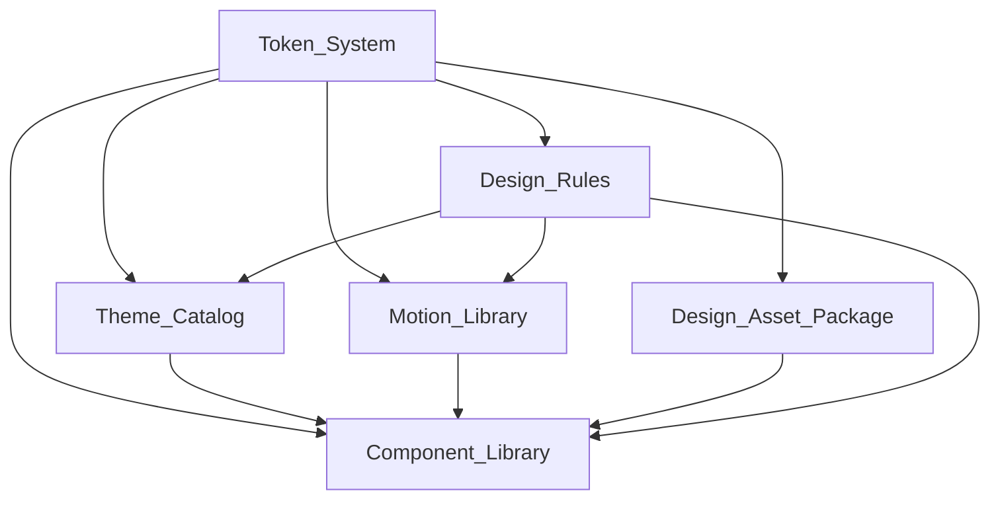

# ProdigeUI Design System — Cohesion Document

## Overview

ProdigeUI is a unified design system where six core artifacts work together as an
interconnected whole. No artifact operates in isolation — each one references, consumes,
or constrains at least one other. This cohesion ensures that a single change at the
foundation (tokens) propagates consistently through themes, motion, components, assets,
and rules without manual edits across scattered files.

The six core artifacts:

| Artifact               | Location           | Role                                       |
|------------------------|--------------------|--------------------------------------------|
| Token_System           | `tokens/`          | Single source of truth for all design values |
| Theme_Catalog          | `themes/`          | Named value sets applied over tokens        |
| Motion_Library         | `motion/`          | Parameterized animation/transition presets  |
| Component_Spec_Catalog | `components/`      | Agent-consumable UI contracts; no bundled framework code |
| Design_Asset_Package   | `assets/`          | Curated icons, fonts, illustrations         |
| Design_Rules           | `design-rules/`    | Measurable rules for typography, color, layout, structure |

## Dependency Graph



**Reading the graph:** An arrow from A to B means "B depends on A" or equivalently
"A feeds into B." Token_System sits at the root — every other artifact depends on it
directly.

## Per-Artifact Dependencies

### Token_System (root)

- **Depends on:** Nothing. It is the foundational source of truth.
- **Depended on by:** Theme_Catalog (overrides token values), Motion_Library (duration
  and easing tokens), Component_Library (all visual values), Design_Rules (references
  spacing/type scales), Design_Asset_Package (icon sizing tokens).
- **Key files:** `primitive.tokens.json`, `semantic.tokens.json`, `component.tokens.json`

### Theme_Catalog

- **Depends on:** Token_System (themes override semantic token values), Design_Rules
  (contrast ratios and color role assignments constrain theme values).
- **Depended on by:** Component_Library (components render using the active theme's
  resolved tokens).
- **Key files:** `_default.theme.json`, `light.theme.json`, `dark.theme.json`

### Motion_Library

- **Depends on:** Token_System (each preset references motion duration and easing tokens),
  Design_Rules (timing boundaries informed by cognitive load principles).
- **Depended on by:** Component_Library (interactive components use motion presets for
  transitions and state changes).
- **Key files:** `motion.tokens.json`, `presets/*.json`, `principles.md`

### Component_Library

This layer is a specification catalog. Agents implement its contracts in the target
framework; ProdigeUI does not expose importable component source or pretend that the empty
atomic taxonomy folders contain runtime implementations.

- **Depends on:** Token_System (all visual values via component tokens), Theme_Catalog
  (resolved values come from active theme), Motion_Library (animation presets for
  interactions), Design_Asset_Package (icon and font references), Design_Rules
  (structural and layout constraints).
- **Depended on by:** Nothing directly — it is the primary consumer, the leaf of the
  dependency tree. Prompt templates and use-case guides reference it, but those are
  orchestration layers outside the six core artifacts.
- **Key files:** `components.manifest.json`, `composition-guidelines.md`

### Design_Asset_Package

- **Depends on:** Token_System (icon sizes and font scale tokens determine rendering
  dimensions).
- **Depended on by:** Component_Library (components reference asset IDs for icons and
  fonts).
- **Key files:** `assets.manifest.json`, `icons/`, `fonts/`, `illustrations/`

### Design_Rules

- **Depends on:** Token_System (rules reference token scales — spacing base unit,
  type scale ratio, contrast values — rather than hardcoding literals).
- **Depended on by:** Theme_Catalog (themes must satisfy contrast and color role rules),
  Motion_Library (timing constraints), Component_Library (structural and layout rules
  constrain component composition).
- **Key files:** `typography.rules.json`, `color.rules.json`, `layout.rules.json`,
  `structure.rules.json`

## Token_System as Root

Token_System occupies the root position because every design decision ultimately resolves
to a token value. The three-layer architecture enforces this:

1. **Primitive tokens** — concrete values (palette colors, raw spacing scale, font sizes).
2. **Semantic tokens** — role-based names referencing primitives (`color.surface.primary`
   → `palette.white`).
3. **Component tokens** — component-specific names referencing semantic tokens
   (`button.primary.bg` → `color.action.primary`).

No other artifact defines values from scratch. Themes override primitives, motion presets
reference motion tokens, components reference component tokens, rules reference scale
tokens. The chain always terminates at Token_System.

## Change Propagation

When a value changes at any layer, the effect propagates downward automatically through
the reference chain:

```
Primitive change          Semantic update           Component update        Theme reflects
─────────────────────────────────────────────────────────────────────────────────────────
palette.blue.500          color.action.primary      button.primary.bg       All themes using
  "#3b82f6" → "#2563eb"    (still refs blue.500)     (still refs action)     this primitive
                             resolves to new value      resolves to new         show new blue
                                                        value automatically     on buttons
```

### Propagation rules

1. **Primitive → Semantic:** Semantic tokens hold references, not copies. Changing a
   primitive value instantly updates every semantic token pointing to it.
2. **Semantic → Component:** Same reference mechanism. Component tokens resolve through
   semantic tokens to the new primitive value.
3. **Primitive → Theme:** Themes override primitives. If a theme references a changed
   primitive, the theme's resolved output reflects the new value.
4. **Token → Design_Rules:** Rules reference token names for their scale definitions.
   When the spacing base unit token changes, rules and Quality_Gate validations
   automatically evaluate against the new value.
5. **Token → Motion:** Motion presets reference duration/easing tokens. Changing a
   motion token updates all presets that use it.
6. **Cross-artifact consistency:** Because all artifacts reference the same Token_System,
   there is no drift. A single edit to `primitive.tokens.json` cascades through the
   entire system without touching any other file.

This architecture eliminates manual synchronization — the design system stays cohesive
by construction, not by discipline.
